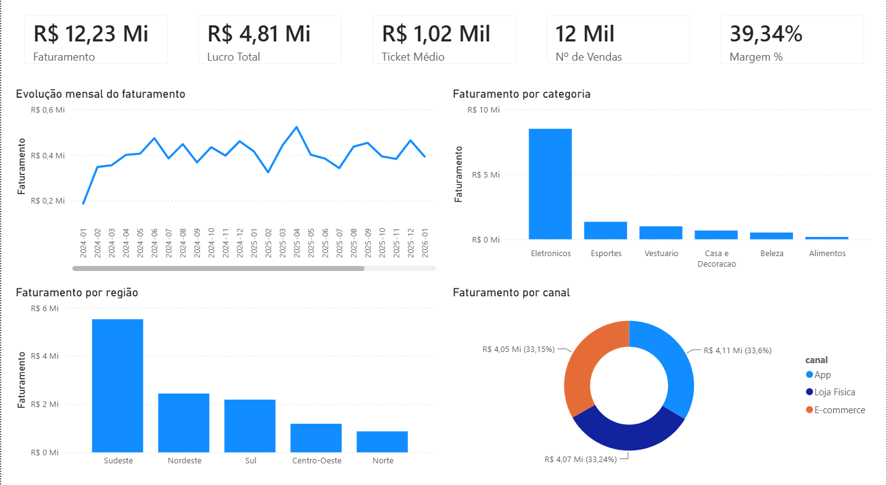
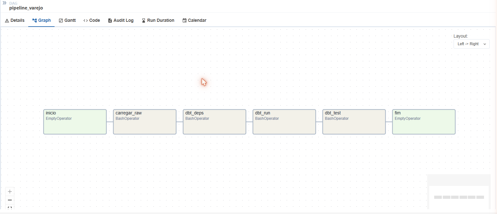

# 🛒 Análise de Vendas de Varejo — Portfólio de Analista de Dados

Projeto **end-to-end** de análise de dados de varejo: da geração e limpeza dos
dados (ETL) até a modelagem, consultas SQL, análise em Python e dashboards de BI.

> **Objetivo:** transformar dados brutos e "sujos" de vendas em informações
> estratégicas para apoiar a tomada de decisão — simulando o dia a dia real de
> um(a) Analista de Dados.

### 📈 Dashboard ao vivo (Looker Studio)

**➡️ [Abrir o "Painel de Vendas — Varejo"](https://lookerstudio.google.com/reporting/db132d4d-779f-4eca-bd0b-3385f7763813)**

Painel interativo com 5 KPIs (Faturamento, Lucro, Ticket médio, Nº de vendas,
Margem %) e gráficos de evolução mensal, categoria, região e canal.
Acesso público — não é preciso login.

### 📊 Dashboard em Power BI

A mesma análise construída também no **Power BI** — a ferramenta pedida na maioria
das vagas de Analista no Brasil. Modelo semântico (medidas DAX) e visuais versionados
em **TMDL/PBIR** (Power BI *Developer Mode*), tratados como código.



> 5 KPIs no topo · evolução mensal · faturamento por categoria e região · mix por canal.

---

## 💼 Resumo executivo — o caso de negócio

> **Pergunta central:** *como a rede pode **aumentar o lucro** sem depender apenas de
> crescer o volume de vendas?*

**Panorama (jan/2024 a jul/2026, dados fictícios):** R$ 12,23 mi de faturamento ·
R$ 4,81 mi de lucro · **margem de 39,3%** · ticket médio de R$ 1.019 em 12.000 vendas.

### O que os dados mostram

1. **Concentração de risco em Eletrônicos.** A categoria responde por **69,6%** do
   faturamento, mas tem a **menor margem de todas: 34,1%**. O negócio está apoiado em
   um único pilar — de alto giro e baixa rentabilidade.
2. **As categorias mais rentáveis estão subexploradas.** Vestuário, Beleza, Casa e
   Alimentos somam margem de **58,2%**, mas apenas **19,4%** do faturamento. Vestuário
   é o **2º maior em nº de vendas** (2.443), porém com ticket de só **R$ 409** — contra
   R$ 2.896 de Eletrônicos: espaço claro para elevar o valor por venda.
3. **Descontos acima de 10% corroem a margem sem trazer volume.** Vendas *sem* desconto
   rendem **41,8%** de margem; acima de 10% a margem cai para **30,7%** — e essa faixa é
   só **13%** das vendas. Estimativa: **~R$ 155 mil de lucro deixados na mesa** nessa faixa.
4. **Dependência do Sudeste.** A região concentra **45,2%** do faturamento; Norte +
   Centro-Oeste juntos ficam em **16,8%** — risco de concentração e espaço para expansão.
5. **Operação omnichannel saudável.** App (33,6%), Loja Física (33,2%) e E-commerce
   (33,2%) estão equilibrados; o **digital já é 66,8%** do faturamento e a Loja Física
   ainda tem o **maior ticket** (R$ 1.037).

### Recomendações acionáveis

| # | Recomendação | Base no dado | Impacto esperado |
|---|--------------|--------------|------------------|
| 1 | **Cross-sell de alta margem** no checkout de Eletrônicos (Beleza/Casa/Vestuário) | Eletrônicos = 69,6% do fat. com margem de só 34,1% | Melhora a margem consolidada a cada ponto de mix migrado |
| 2 | **Rever política de desconto:** testar teto de 10% e medir elasticidade | Faixa >10% tem margem 30,7% vs 41,8%; ~R$ 155 mil de lucro potencial | Recupera margem sem perder volume relevante |
| 3 | **Elevar ticket de Vestuário** com kits/bundles e upsell | 2.443 vendas, mas ticket de só R$ 409 | Converte alto giro em mais faturamento e lucro |
| 4 | **Expansão regional seletiva** (Norte/Centro-Oeste) | Sudeste 45,2% vs 16,8% das duas regiões | Diversifica receita e reduz risco de concentração |

*Consultas SQL que sustentam cada ponto: [`sql/analises.sql`](sql/analises.sql).*

### Gráficos de apoio

**Faturamento por categoria** — a concentração em Eletrônicos


**Evolução mensal** — faturamento oscila ±20% sem tendência clara (negócio maduro)


**Margem por categoria** — as categorias menores são as mais rentáveis


---

## 🎯 O que este projeto demonstra

| Competência | Onde está no projeto |
|-------------|----------------------|
| **Python** (pandas, numpy) | Geração de dados, ETL e análise |
| **SQL** (JOINs, window functions, CTEs) | [`sql/analises.sql`](sql/analises.sql) |
| **Modelagem de dados** (modelo estrela) | Banco SQLite: fato + dimensões |
| **ETL / tratamento de dados** | [`scripts/02_etl.py`](scripts/02_etl.py) |
| **Power BI** (DAX · Power Query · TMDL) | Modelo e visuais como código — [`dashboard/powerbi/`](dashboard/powerbi/) |
| **Business Intelligence** | Dois dashboards: [Looker Studio](https://lookerstudio.google.com/reporting/db132d4d-779f-4eca-bd0b-3385f7763813) (ao vivo) + Power BI |
| **Storytelling com dados** | Resumo executivo (número → insight → recomendação) |
| **Automação / reprodutibilidade** | Pipeline via scripts numerados (seeds fixas) |
| **Git / versionamento** | Este repositório |

---

## 🏗️ Bônus: pipeline de Engenharia de Dados

Além da análise (foco de Analista de Dados), o projeto foi evoluído para uma
**stack de dados moderna** — do dado bruto ao mart analítico, na nuvem,
transformado como código, testado e **orquestrado**:

```
CSV tratado ──► BigQuery (raw) ──► dbt (staging → marts estrela) ──► testes ✓
                    │                        │
                    └──── Airflow (Docker) orquestra tudo ────┘
```

| Camada | Tecnologia | O que faz |
|--------|-----------|-----------|
| **Data Warehouse** | Google BigQuery | Camada `raw` (12.000 vendas) na nuvem |
| **Transformação** | dbt | Modelo estrela (`fct_vendas` + dimensões) versionado em SQL |
| **Qualidade** | dbt tests | 20 testes: `unique`, `not_null`, `relationships`, `accepted_values` |
| **Orquestração** | Apache Airflow + Docker | DAG `carregar_raw → dbt_run → dbt_test`, agendado e com retry |
| **IaC / CI-CD** | Terraform + GitHub Actions | Datasets como código + validação automática a cada PR |

### DAG orquestrando o pipeline (Airflow)


> 📋 O plano completo de evolução está em [`ROADMAP_DE.md`](ROADMAP_DE.md).
> Código: [`dbt/`](dbt/) · [`orchestration/`](orchestration/) · [`infra/`](infra/)

---

## 🗂️ Estrutura do projeto

```
portfolio-varejo/
├── dados/
│   ├── bruto/          # vendas_bruto.csv  (dados "sujos", como chegam do sistema)
│   └── tratado/        # vendas_tratado.csv + varejo.db (SQLite, modelo estrela)
├── scripts/
│   ├── 01_gerar_dados.py       # gera a base fictícia de vendas
│   ├── 02_etl.py               # ETL: limpa, padroniza e enriquece + carrega no SQLite
│   └── 03_construir_notebook.py# monta o notebook de análise
├── sql/
│   └── analises.sql            # 10 consultas de negócio (JOIN, LAG, RANK, CTE...)
├── notebooks/
│   └── analise_vendas.ipynb    # análise exploratória com gráficos
├── dashboard/
│   ├── powerbi/                # projeto .pbip (modelo TMDL + relatório PBIR) — dashboard como código
│   └── GUIA_DASHBOARD.md       # guia do dashboard no Looker Studio
├── imagens/            # gráficos exportados
├── requirements.txt
└── README.md
```

---

## 🔄 O pipeline de dados

```
  Dados brutos          ETL (Python)              Dados confiáveis
  (CSV "sujo")   ──►   limpeza + padronização  ──►  CSV tratado + SQLite
  nulos, dupli-        + colunas calculadas          (modelo estrela)
  cados, datas                                             │
  inconsistentes                                           ▼
                                                   SQL + Python + BI
                                                   (insights de negócio)
```

**O que o ETL corrige automaticamente:**
- ✅ Remove 240 registros duplicados
- ✅ Padroniza categorias e formas de pagamento (maiúsculas/espaços)
- ✅ Trata valores nulos (cidade e forma de pagamento)
- ✅ Normaliza datas em formatos diferentes (`AAAA-MM-DD` e `DD/MM/AAAA`)
- ✅ Corrige 120 valores negativos (erros de sistema)
- ✅ Cria colunas de análise (lucro, margem, ano/mês, trimestre...)

---

## ▶️ Como executar

```bash
# 1. Clonar o repositório
git clone <url-do-repo>
cd portfolio-varejo

# 2. Criar o ambiente virtual e instalar dependências
python -m venv .venv
.venv\Scripts\activate        # Windows
pip install -r requirements.txt

# 3. Rodar o pipeline completo
python scripts/01_gerar_dados.py     # gera a base bruta
python scripts/02_etl.py             # ETL -> CSV tratado + banco SQLite

# 4. Explorar a análise
jupyter notebook notebooks/analise_vendas.ipynb

# 5. Rodar as consultas SQL (ex.: DB Browser for SQLite ou VS Code)
#    Banco: dados/tratado/varejo.db
```

---

## 🛠️ Tecnologias

`Python` · `pandas` · `numpy` · `matplotlib` · `seaborn` · `SQL` · `SQLite` ·
`Jupyter` · `Power BI` (DAX · Power Query · TMDL) · `Looker Studio` · `Git`

---

## 👤 Autor

**Roberto Chagas** — Desenvolvedor em transição para **Análise de Dados**.
Uno base técnica sólida (programação, SQL, Python, Git) com foco em transformar
dados em decisão de negócio.

📧 robertochagas.ti@gmail.com · 💻 [github.com/betinhochagas](https://github.com/betinhochagas)

> Projeto desenvolvido como portfólio para vagas de Análise de Dados.
> Os dados são **fictícios**, gerados via `Faker` para fins de demonstração.
