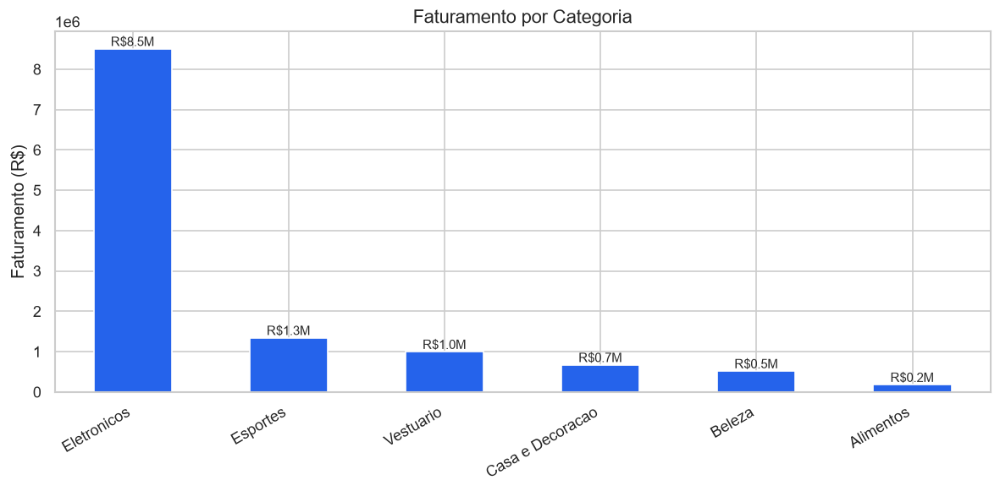
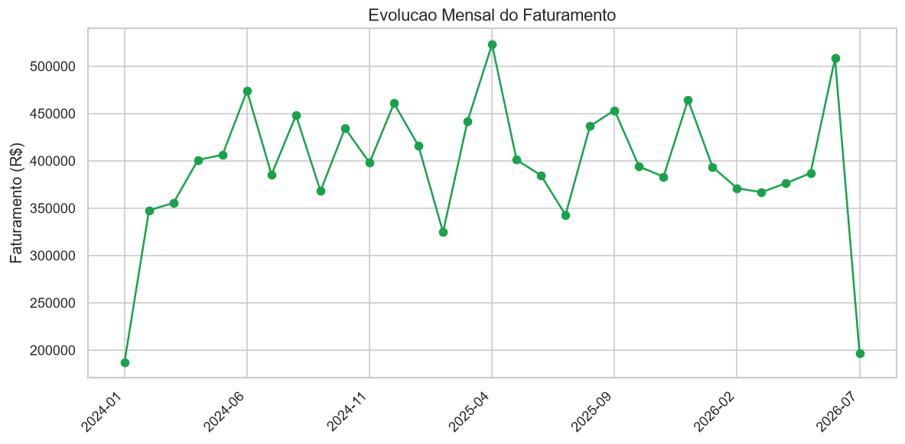
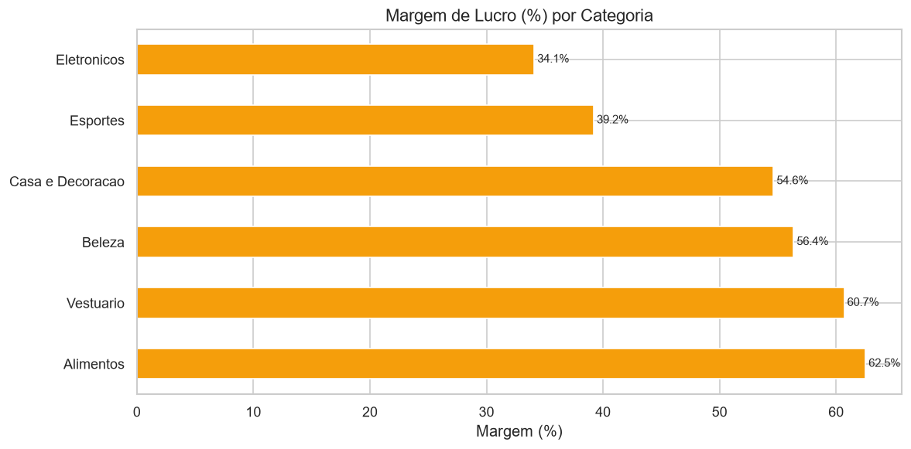

# 🛒 Análise de Vendas de Varejo — Portfólio de Analista de Dados

Projeto **end-to-end** de análise de dados de varejo: da geração e limpeza dos
dados (ETL) até a modelagem, consultas SQL, análise em Python e dashboard de BI.

> **Objetivo:** transformar dados brutos e "sujos" de vendas em informações
> estratégicas para apoiar a tomada de decisão — simulando o dia a dia real de
> um(a) Analista de Dados.

### 📈 Dashboard ao vivo (Looker Studio)

**➡️ [Abrir o "Painel de Vendas — Varejo"](https://lookerstudio.google.com/reporting/db132d4d-779f-4eca-bd0b-3385f7763813)**

Painel interativo com 5 KPIs (Faturamento, Lucro, Ticket médio, Nº de vendas,
Margem %) e gráficos de evolução mensal, categoria, região e canal.
Acesso público — não é preciso login.

---

## 🎯 O que este projeto demonstra

| Competência | Onde está no projeto |
|-------------|----------------------|
| **Python** (pandas, numpy) | Geração de dados, ETL e análise |
| **SQL** (JOINs, window functions, CTEs) | [`sql/analises.sql`](sql/analises.sql) |
| **Modelagem de dados** (modelo estrela) | Banco SQLite: fato + dimensões |
| **ETL / tratamento de dados** | [`scripts/02_etl.py`](scripts/02_etl.py) |
| **Business Intelligence** | [Dashboard no Looker Studio](https://lookerstudio.google.com/reporting/db132d4d-779f-4eca-bd0b-3385f7763813) |
| **Automação** | Pipeline reprodutível via scripts numerados |
| **Git / versionamento** | Este repositório |
| **Visualização & storytelling** | [`notebooks/analise_vendas.ipynb`](notebooks/analise_vendas.ipynb) |

---

## 📊 Principais resultados

- **Faturamento total:** R$ 12,2 milhões em 12.000 vendas
- **Ticket médio:** R$ 1.019
- **Categoria líder:** Eletrônicos (≈70% do faturamento)
- **Maior margem:** Alimentos e Vestuário (>60%)
- **Região líder:** Sudeste (≈45% do faturamento)

### Faturamento por categoria


### Evolução mensal


### Margem de lucro por categoria


---

## 🗂️ Estrutura do projeto

```
portfolio-varejo/
├── dados/
│   ├── bruto/          # vendas_bruto.csv  (dados "sujos", como chegam do sistema)
│   └── tratado/        # vendas_tratado.csv + varejo.db (SQLite, modelo estrela)
├── scripts/
│   ├── 01_gerar_dados.py       # gera a base fictícia de vendas
│   ├── 02_etl.py               # ETL: limpa, padroniza e enriquece + carrega no SQLite
│   └── 03_construir_notebook.py# monta o notebook de análise
├── sql/
│   └── analises.sql            # 10 consultas de negócio (JOIN, LAG, RANK, CTE...)
├── notebooks/
│   └── analise_vendas.ipynb    # análise exploratória com gráficos
├── dashboard/          # arquivo do Power BI / link do Looker Studio
├── imagens/            # gráficos exportados
├── requirements.txt
└── README.md
```

---

## 🔄 O pipeline de dados

```
  Dados brutos          ETL (Python)              Dados confiáveis
  (CSV "sujo")   ──►   limpeza + padronização  ──►  CSV tratado + SQLite
  nulos, dupli-        + colunas calculadas          (modelo estrela)
  cados, datas                                             │
  inconsistentes                                           ▼
                                                   SQL + Python + BI
                                                   (insights de negócio)
```

**O que o ETL corrige automaticamente:**
- ✅ Remove 240 registros duplicados
- ✅ Padroniza categorias e formas de pagamento (maiúsculas/espaços)
- ✅ Trata valores nulos (cidade e forma de pagamento)
- ✅ Normaliza datas em formatos diferentes (`AAAA-MM-DD` e `DD/MM/AAAA`)
- ✅ Corrige 120 valores negativos (erros de sistema)
- ✅ Cria colunas de análise (lucro, margem, ano/mês, trimestre...)

---

## ▶️ Como executar

```bash
# 1. Clonar o repositório
git clone <url-do-repo>
cd portfolio-varejo

# 2. Criar o ambiente virtual e instalar dependências
python -m venv .venv
.venv\Scripts\activate        # Windows
pip install -r requirements.txt

# 3. Rodar o pipeline completo
python scripts/01_gerar_dados.py     # gera a base bruta
python scripts/02_etl.py             # ETL -> CSV tratado + banco SQLite

# 4. Explorar a análise
jupyter notebook notebooks/analise_vendas.ipynb

# 5. Rodar as consultas SQL (ex.: DB Browser for SQLite ou VS Code)
#    Banco: dados/tratado/varejo.db
```

---

## 🛠️ Tecnologias

`Python` · `pandas` · `numpy` · `matplotlib` · `seaborn` · `SQL` · `SQLite` ·
`Jupyter` · `Power BI / Looker Studio` · `Git`

---

## 👤 Autor

**Roberto Chagas** — Analista de Dados
📧 robertochagas.ti@gmail.com

> Projeto desenvolvido como portfólio para vagas de Análise de Dados.
> Os dados são **fictícios**, gerados via `Faker` para fins de demonstração.
